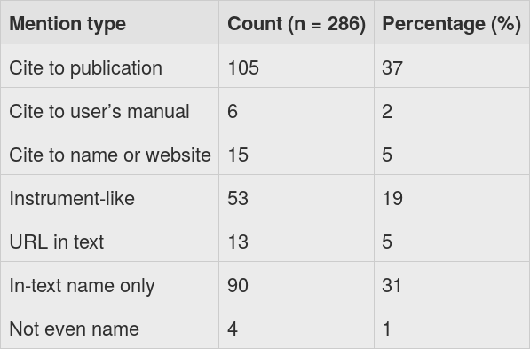

<h1 class="norm">FAIRly SUSTAINABLE RESEARCH SOFTWARE?</h1>

Stephan Druskat

Developer Forum der Humboldt-Universität, 15. Okt. 2018

Folien: https://sdruskat.net/hu-dev-forum-2018/

Note:
Naiveté, regression, despair


## About

- ORCID [0000-0003-4925-7248](https://orcid.org/0000-0003-4925-7248)
- Magister Anglistik, Linguistik, neuere dt. Literatur
- seit 2008: Softwareentwicklung in der Forschung
- <span class="fragment highlight-red">Research Software Engineer (RSE)</span>, Inst. f. dt. Sprache und Linguistik XXX
- Mitbegründer [de-RSE](https://de-rse.org/)
- [Special Collaborator](https://fellows.software.ac.uk/) des [Software Sustainability Institute](https://www.software.ac.uk/)
- Forschungsinteressen: Nachhaltigkeit von Forschungssoftware, Softwarezitierung


## Research Software Engineer?

<ul class="fragment fade-in">
<li>Softwareentwickler mit Domänenwissen</li>
<li>Softwaretechnik > Nachnutzbarkeit, "Korrektheit"</li>
<li>Sichtbarkeit des Tätigkeitsfeldes</li>
</ul>

<ul class="fragment fade-in">
<li>[Vereinsgründung *de-RSE e.V. - Gesellschaft für Forschungssoftware*](https://www.de-rse.org/de/association.html): 26.11.2018</li>
<li>Konferenz [*#deRSE19*](https://www.de-rse.org/de/conf2019/index.html): 4.-6.6.2019, Potsdam</li>


## Forschungssoftware? 

DFG:

> Eigens zum wissenschaftlichen Erkenntnisgewinn erstellte Software-Anwendungen und Software-Bibliotheken

Note:
- Skripte
- komplexe Anwendungen


## Nachhaltige Forschungssoftware? 

> Nachhaltigkeit ist die Fähigkeit einer Software, Bestand zu haben, also
zukünftig verfügbar zu sein, auch auf neuen Plattformen, und neuen Bedürfnissen
gerecht zu werden.  
[Daniel S. Katz](https://danielskatzblog.wordpress.com/2016/09/13/defining-software-sustainability/)

- Viele Aspekte
- [Viele Blickwinkel](https://danielskatzblog.wordpress.com/2018/09/26/fundamentals-of-software-sustainability/)
- Realität?


## Wozu nachhaltige Forschungssoftware?

- Reproduzierbarkeit von Forschungsergebnissen.
- Wie Forschungssoftware nachhaltig entwickeln?

Note:
Forschungsdaten und darauf beruhende Forschungsergebnisse sind ohne Überprüfbarkeit
der Methode durch die sie erlangt oder analysiert worden sind nicht stichhaltig
zu evaluieren.


<h2 class="norm">FAIRe Software?</h2>

- Modell Forschungsdaten: [**F**indable, **A**ccessible, **I**nteroperable, **R**eusable](http://www.forschungsdaten.org/index.php/FAIR_data_principles)
- FAIR-Prinzipien bestehen nur auf Zugänglichkeit der Metadaten
- Credit (Anerkennung) spielt keine Rolle
- [FORCE11 Scholarly Commons WG](https://www.force11.org/group/scholarly-commons-working-group): "Open, FAIR, citable"
- https://danielskatzblog.wordpress.com/2017/06/22/fair-is-not-fair-enough/


<h2 class="norm">Faire Software?</h2>

- Credit für Software?
- Systeme für Softwarecredit?
- Wie wird Software zitiert?



[10.7717/peerj.2394/table-1](https://doi.org/10.7717/peerj.2394/table-1)


## Citation File Format

- [Format für Softwarezitierungsmetadaten](https://citation-file-format.github.io/)
- `CITATION.cff`

```yaml
cff-version: 1.0.3
message: "If you use this software, please cite it as below."
authors:
  - family-names: Druskat
    given-names: Stephan
    orcid: "https://orcid.org/0000-0003-4925-7248"
title: My Research Tool
version: "1.0.4"
doi: "10.5281/zenodo.1234"
date-released: 2017-12-18

```


## Best practices

- Softwaretechnik!
- Institutionsleitlinien (z.B. [Deutsches Zentrum für Luft- und Raumfahrt](https://doi.org/10.5281/zenodo.1344608))
- ["Handreichung zum Umgang mit Forschungssoftware"](https://doi.org/10.5281/zenodo.1172970)
- HU?

Note:
- "Allianz der deutschen Wissenschaftsorganisationen"
- Open Access-Erklärung erwähnt Software nicht


## [Good enough practices](https://doi.org/10.1371/journal.pcbi.1005510)

1.	Place a brief explanatory comment at the start of every program.
2.	Decompose programs into functions.
3.	Be ruthless about eliminating duplication.
4.	Always search for well-maintained software libraries that do what you need.
5.	Test libraries before relying on them.
6.	Give functions and variables meaningful names.
7.	Make dependencies and requirements explicit.
8.	Do not comment and uncomment sections of code to control a program's behavior.
9.	Provide a simple example or test data set.
10.	Submit code to a reputable DOI-issuing repository.

Note:
- Wilson et al. "Good enough practices in scientific computing", PLOS Computational Biology


## Document All The Things!!1!11ELF(?)


## Good enough practices (of documentation)

- "Brief explanatory comment at the start of every program"?
- Was?
- Wie tief?
- Wie breit?
- Wie meta?
- Wie?


# Danke!

- **Software Sustainability Institute**: EPSRC, BBSRC, ESRC Grant EP/N006410/1
- **Projektförderung:** DFG grant GA 1288/11 ("Research software sustainability")

Folien: https://sdruskat.net/hu-dev-forum-2018

stephan.druskat@hu-berlin.de, <i class="fa fa-twitter"/></i> [@stdruskat](https://twitter.com/stdruskat),
<i class="fa fa-github"/></i> [@sdruskat](https://github.com/sdruskat)
