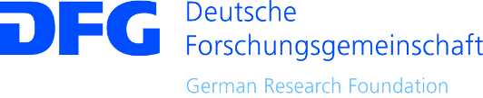

<h1 class="norm">FAIRly SUSTAINABLE RESEARCH SOFTWARE?</h1>

Stephan Druskat

Developer Forum der Humboldt-Universität, 15. Okt. 2018

Slides: https://sdruskat.net/hu-dev-forum-2018/ XXX

Note:
Naiveté, regression, despair

## About

- Research Software Engineer (RSE), Inst. f. dt. Sprache und Linguistik XXX
- Mitbegründer de-RSE XXX
- Special Collaborator des Software Sustainability Institute XXX
- Forschungsinteressen: Nachhaltigkeit von Forschungssoftware, Softwarezitierung

# Research Software Engineer?

# Document! All! The! Things!

# Thanks!

**RSE18 Mentoring Programme:** Neil Chue Hong 

**The Software Sustainability Institute** for funding assistance (EPSRC, BBSRC, ESRC Grant EP/N006410/1)

**Project funding:** DFG grant GA 1288/11 ("Research software sustainability")

 

